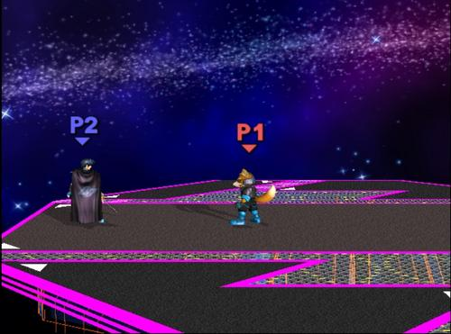
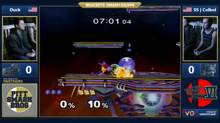
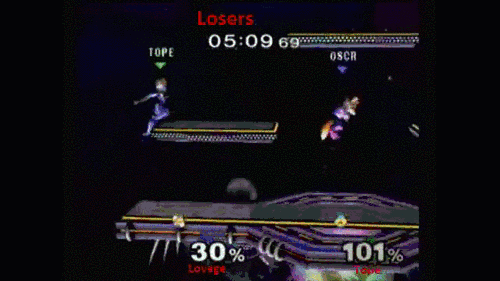
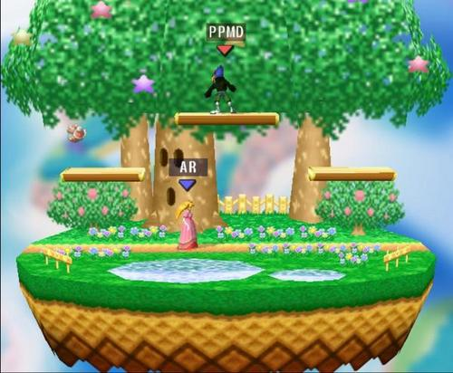

> Welcome to [my neutral game guide](http://clgaming.net/news/829-sfats-neutral-game-guide)! I would like to start off by saying that it is humanly impossible to write a comprehensive guide on how to play the Melee neutral game, because there are near infinite neutral game situations that exist! I cannot definitively answer, “What should I do when I’m Fox on the platforms above Marth in neutral?”, because the answer changes based on countless variables. So instead, this guide will break down my understanding of the neutral game in a broader sense, as to best explain the general concepts and scenarios that a player should be looking for and looking out for in the neutral game. This guide will only discuss the singles neutral game, as the doubles neutral game is its own beast entirely.

So to start off, the term **neutral game** itself needs to be properly defined. My definition is as follows:

> “A state in the game before a player lands a hit that has the potential to lead to a follow-up, an edge guard or back to advantageous neutral.”     

But SFAT! Isn't “advantageous neutral” an oxymoron? Isn't neutral just neutral? The term “neutral game” is honestly a bit of a misnomer. Referring to all of the “non-punish-game” scenarios as “neutral” implies that neither player can be at an advantageous position, which is *generally untrue*. In reality, the neutral game breaks down into three broad categories:

- **Advantageous neutral**
- **True neutral**
- **Disadvantageous neutral**

### Advantageous/Disadvantageous Neutral

When a player is at **advantageous neutral** they have the upper hand in landing the next significant hit. Understanding when you are at advantageous or disadvantageous neutral requires a general knowledge of each character’s “options” in a given situation. For example:

#### 			      	     PANEL 1						      PANEL 2

In these two neutral game scenarios both players are in identical positions. 

In Panel 1, Falco is at *advantageous neutral* due to the threat of his down-air compounded by Peaches’ weak anti-air options off the ground. 

In Panel 2, however, Falco is at *disadvantageous neutral* because Marth’s potent anti-air options (up-tilt and up-air) can adequately combat Falco’s down-air.

Awareness of the relative power and utility of each character’s options is the first and most vital step towards mastering the neutral game. If the concept of advantageous neutral still seems strange to you, there are some classic examples that, regardless of your skill-level or main, you’ve probably experienced. Here is one:

Because most characters make use of their dash back or wave-dash back as grounded options in neutral, their retreat area in the corner is cut off. Because they can effectively only move and attack forward, a **cornered player’s options are severely limited**, putting them at a strong disadvantage in landing the next significant hit.

Think about where your character’s tools matchup well against your opponent’s and try to maximize those advantageous situations in neutral. Watch high level matches and look for the positions that result in victorious neutral exchanges and try to emulate these positions in your own matches.

### The Two Classes of Action: Soft vs. Hard Commitments

In explaining advantageous/disadvantageous neutral, I discussed the neutral game from the perspective of position (where a player is relative to their opponent). But achieving a favorable position and subsequently landing a hit can only be the result of action.

Every neutral game action a player takes after the announcer shouts “GO!”, falls into one of two classes: a **hard commitment** or **a soft commitment**. A **hard commitment** is when a player issues an action in neutral that is immediately punishable by an opponent. Here is an example:

In this sequence, Colbol’s grab attempt is a hard commitment. Duck recognizes Colbol’s advance and punishes it with wavedash back into down-smash and nets himself a stock.

Hard commitments don’t only have to be attacks! A player can hard commit with their movement as well. Rolling from the corner is a common example of this.

Conversely, a **soft commitment** is when a player issues an action in neutral, that is NOT immediately punishable by an opponent. Here is an example:

In this clip Mango uses multiple dash forwards as soft commitments. With each dash forward Mango feigns an approach, because he has access to his dash back he remains safe from punishment. Armada takes the bait and hard commits twice, first with neutral-air out of shield and then dash-attack. 

Soft commitments are usually moves with little to no lag attached to them, or projectiles that can be fired safely out of range of counter-attack. Bear in mind that how you USE a move defines whether it is a soft or a hard commitment, not the move itself. As Falco, the distance between you and you opponent changes whether firing a laser is a soft or a hard commitment.

In both of the above clips, a hard commitment is baited out by a soft commitment and then punished. This interaction is the heart of Melee’s neutral game. One of your main goals in neutral is to lure your opponent into hard committing with your own soft commitments and then punishing their lag. Most players will hard commit after only two seconds of neutral exchanges, so being just one nanosecond more patient than your opponent can pay off huge dividends in your matches. 

Now I’m not saying you should never hard commit in neutral, but you should be cognizant of why you are, and the risk associated with doing so. Every action you take should have intention behind it. For example, Sheik’s dash attack in neutral is almost always a hard commitment, but the risk reward of using it changes based on the opponent’s percent. If you are a Sheik player and notice your opponent doesn’t utilize crouch-cancel, her dash attack’s risk/reward changes drastically.

Here is an example of a game-winning hard commitment:

Lovage’s upsmash is 100% a hard commitment. We can hypothesize a few factors that led to this up-smash connecting. Firstly, Lovage’s flurry of soft-commitment neutral-air → shines from advantageous neutral inflicted heavy mental pressure on Tope. As a veteran player Lovage knows that his opponent in shield has limited options and rolling out of the corner is the easiest to execute in the fight or flight mode he had forced Tope into. The moment Lovage lets up on his pressure, Tope takes the bait, hard commits with roll towards center stage and then--Boom. 

When and how you should use hard commitments changes based on the habits and tendencies of the player sitting opposite you, which is why you should always…

### Watch Your Opponent!

One of the first lessons I learned in Melee is to watch my opponent's character and not my own. What are their habits in neutral? Do they like taking to the platforms or playing more grounded? Do they try to fight when pinned in the corner, or do they attempt to vacate the situation with movement? Do they like to full hop Falcon punch across the stage into a double taunt? Every player has a rhythm to how they play neutral. This information is critical to prepare the proper countermeasures for whatever your opponent likes to throw at you.

Remember this picture?

Earlier I stated that Falco is at advantageous neutral. Well this is not necessarily 100% true. If Armada has noticed that PPMD likes to drop through down-air every time in this scenario he may be baiting out that option by putting himself in a seemingly punishable position. When you play, try to be conscious of your gameplay, and when you watch your recorded footage, look where you lost a neutral exchange and ask yourself, “Why did I get hit here?”

### The Mental Side of Neutral

The neutral game is without a doubt the most mentally taxing part of playing Melee. There are so many options to consider that allocating your mental energy correctly is incredibly important. 

Mentally, what you want to strive for, is to remove your outside self from the game and immerse yourself fully within it. Don’t dwell on the PR rank your opponent is, or how they are the “X character slayer”. All that matters is the game before you. If you mess up in the game, don’t allow the downward spiral of losing get to you, keep rolling with it. 

Getting caught up in negative emotions wastes your mental energy and focus. Have self belief and confidence in your decisions, even if the results dictate that you shouldn’t be confident. This philosophy isn’t unique to just Melee, *it can be applied to any competitive discipline*. Remember that even the most seemingly unwinnable games are potentially only four neutral exchanges away from victory. 

#### 						Believe in yourSELF.